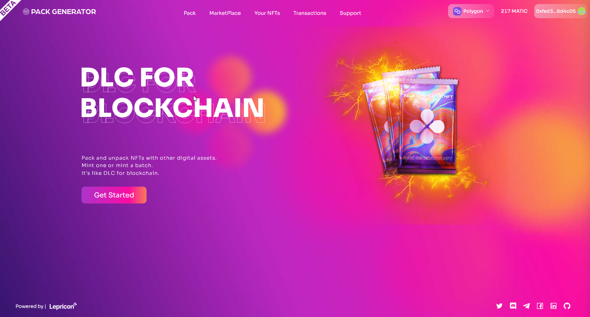

# PACK-GENERATOR - DLC for blockchain

## Description

Cross-chain Dapp deployed on BNB-Chain and Polygon (Ethereum to come soon...). Allow any user to quickly and simply pack and unpack NFTs with other digital assets.
Mint one or mint a batch.

- Website: https://www.packgenerator.io/
  <br></br>



## Installation

````
💿 Clone the repo and install all dependencies:
```sh
git clone https://github.com/shamrockstudios/Pack-Generator.git
cd Pack-Generator
yarn install
````

✏ Create a `.env` file in the main folder and provide your `appId` and `serverUrl` from Moralis ([How to start Moralis Server](https://docs.moralis.io/moralis-server/getting-started/create-a-moralis-server))
Example:

```jsx
REACT_APP_MORALIS_APPLICATION_ID = xxxxxxxxxxxx
REACT_APP_MORALIS_SERVER_URL = https://xxxxxx.grandmoralis.com:2053/server
```

🔎 Locate the constant file in `src/constant/constant.js` and paste your smart-contracts addresses;

```jsx
// Contracts deployed on Ethereum
const assemblyAddressEthereum = "Paste your constract address here";
const factoryAddressEthereum = "Paste your constract address here";
const marketAddressEthereum = "Paste your constract address here";
```

🔎 Locate the abis file in `src/constant/abis.js` and paste your ABIs;

```jsx
export const assemblyABI = "Paste your ABI here";
```

🚴‍♂️ Run your App:

```sh
yarn start
```
